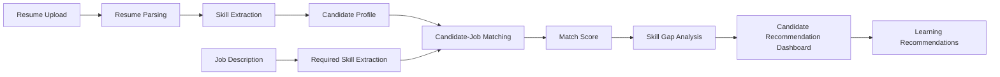

# TalentLens – Recruitment Intelligence Platform

## Project Overview

TalentLens is an AI-powered recruitment intelligence platform designed to streamline resume screening, candidate-job matching, skill gap analysis, and candidate recommendations.

The platform helps recruiters evaluate candidates using explainable matching rather than relying only on manual resume screening.

## Key Features

* Resume upload with PDF, DOCX, and TXT support
* Resume information and skill extraction
* Candidate profile management
* Job description creation and management
* Automatic required-skill extraction from job descriptions
* Candidate-to-job matching
* Explainable match scoring
* TF-IDF cosine similarity for resume-job relevance
* Required-skill coverage analysis
* Matched and missing skill identification
* Skill gap percentage calculation
* Candidate suitability classification:
  * Strong Match
  * Moderate Match
  * Low Match
* Candidate Recommendation Dashboard
* Personalized learning recommendations

## Candidate Recommendation Dashboard

After a candidate and target job are selected, the dashboard presents:

* Overall Match Score
* Required-Skill Coverage
* Resume Relevance
* Skill Gap Percentage
* Suitability Level
* Matched Skills
* Missing Skills
* Explainable Recommendation Summary
* Learning Recommendations

These dashboard values are calculated from the application's actual matching logic and matching response; they are not hard-coded.

## AI Matching Methodology

TalentLens calculates the overall match score as:

```text
Overall match score = 70% required-skill coverage + 30% TF-IDF cosine similarity of resume and job text
```

Required-skill coverage measures how many skills required by the job are present in the candidate profile. TF-IDF (Term Frequency-Inverse Document Frequency) represents the importance of words in the resume and job description. Cosine similarity compares those representations to estimate their textual relevance. Together, these measures provide a transparent combination of explicit skill fit and resume-to-job relevance.

## System Workflow



## Technology Stack

### Frontend

* React
* Vite
* Tailwind CSS
* JavaScript

### Backend

* Python
* FastAPI
* SQLAlchemy

### NLP / Matching

* TF-IDF
* Cosine Similarity
* Rule-based skill extraction

### Database

* SQLite

### Document Processing

* pypdf
* python-docx

## Project Architecture

* `frontend/` contains the React user interface, including the candidate/job workflow and recommendation dashboard.
* `backend/` contains the FastAPI service, Python dependencies, and the local SQLite runtime database.
* `backend/app/` contains the application modules for API routes, database configuration, data models, document parsing, and skill matching helpers.
* The database layer uses SQLAlchemy with SQLite to store candidate profiles and job descriptions.
* The API layer exposes endpoints for health checks, candidate listing and resume upload, job listing and creation, and candidate-job match analysis.

## Validation and Testing

The following checks were successfully performed:

* Frontend production build
* Backend Python compilation
* Backend dependency verification
* API health check
* Candidate listing
* Job listing
* TXT resume upload
* Resume skill extraction
* Candidate-job matching
* Recommendation dashboard validation

The end-to-end test successfully returned a real match score, skill coverage, TF-IDF relevance, skill gap, suitability classification, matched skills, missing skills, and learning recommendations.

## How to Run Locally

Open two Windows PowerShell terminals from the project root.

### Backend

```powershell
cd backend
..\.venv\Scripts\python.exe -m uvicorn app.main:app --host 127.0.0.1 --port 8000
```

### Frontend

```powershell
cd frontend
npm install
npm run dev
```

Vite will display the local frontend URL in the terminal, usually `http://localhost:5173/`. If that port is unavailable, use the URL Vite reports.

## GitHub Project Structure

```text
backend/
frontend/
.gitignore
README.md
```

## Future Enhancements

The following are future enhancements and are not currently implemented:

* Advanced semantic resume-job matching using transformer models
* Multi-resume batch screening
* Recruiter analytics dashboard
* Interview question generation
* Candidate ranking reports
* Explainable AI visualizations
* Authentication and role-based access
* Cloud deployment

## Academic Project Value

TalentLens demonstrates practical application of Artificial Intelligence, Natural Language Processing, Information Retrieval, Machine Learning-based similarity, and full-stack web development. Its transparent scoring, skill-gap analysis, and recommendation output also demonstrate explainable candidate evaluation for recruitment workflows.
